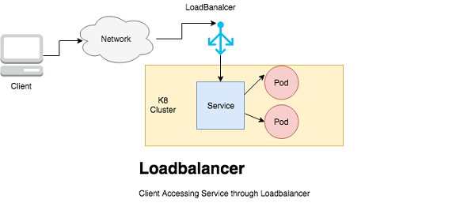

# http_server
A simple Ruby web server.
Serves on port 80.
/healthcheck path returns "OK"
All other paths return "Well, hello there!"
An HTTP status code of 200

`$ ruby http_server.rb`

# Getting Started
On the Makefile in the base directory you will find the command to build the docker image, push to a docker registry and deploy to the cluster using helm chart. I have also highlighted how to manually test the build and deployment.
## Requirement
### Setting up locally 
The following tools should be installed on the workstation. For installation guide refer to the link
* Docker (https://docs.docker.com/engine/install/)
* Ruby (https://www.ruby-lang.org/en/documentation/installation/)
* minikube(https://kubernetes.io/docs/tasks/tools/)
* git (https://git-scm.com/downloads)
* kubectl (https://kubernetes.io/docs/tasks/tools/)
* helm (https://helm.sh/docs/intro/install/)
* Make (http://ftp.gnu.org/gnu/make/)

### Running on your terminal Manually

* Step 1: Clone the project ` git clone https://github.com/ogechivivian/http_server.git`
* Step 2: Open in a code editor  i.e vscode, notepad ++ ....
* Step 3: Launch the following command ` $ ruby http_server.rb `  to start the application on port 80
* Step 4: Launch the browser and access the application on  `http://localhost:80` or `http://localhost:80/healthcheck`

### Building a Docker image with the Dockerfile
There is a Dockerfile located at the base directory. Run the following command from the tterminal to build a docker image `docker build -t {nameoftherepository}:version .` the -t flag is to tag the image 

### Push the image to an Image Registry
The Image on the local machine can be pushed to an Image registry using the `docker push` command.

### Build the Docker Image using Docker-compose
Run `docker-compose up -d` to build the docker image and `docker-compose push` to push the image to a registry

### Build, Push and deploy the application using Make
The following commands are available:
* make build (To build the docker image)
* make push (To push the docker image to a registry)
* make install (To deploy the application on kubernetes)
* make uninstall (To delete the application)
### Deploy the Application on Minikube
 Run `helm install deploy charts/httpchart/` to deploy the service, hpa and deployment on the cluster

### Access the application
A LoadBalancer service is the standard way to expose a service to the internet. With this method, each service gets its own IP address\
In the test we are using the localhost and exposed port 30904 specified on the service.yaml file in the templates folder. To access the 
application deployed launch `http://localhost:30904` and `http://localhost:30904/healthcheck`

### Architecture 

### Troubleshooting

## Confirm the deployments,service and hpa wth the kubectl utility
Run this command `kubectl get svc` to confirm the service is deployed.\
On the browser you can access the application endpoints  on `http://localhost:30904` or `http://localhost:30904/healthcheck`\
To check the deployment `kubectl get deployment`\
* `kubectl get hpa` returns the hpa
* `kubectl get pods` returns the pods

## Interact with the docker image
After a successful docker build view the image with `docker images` command.\
To start and test the image run `docker run -it -p 80:80 imagename` this will start a docker container and expose it on port 80 and can be accessible from the browser `http://localhost:80` or `http://localhost:80/healthcheck`. This can be tested on the terminal using the curl command `curl -v http://localhost:80`

